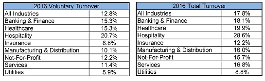
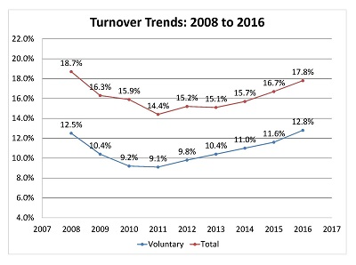

<style>
.small-code pre code {
  font-size: 5em;
}
</style>

```{r setup, include=FALSE}
knitr::opts_chunk$set(echo = FALSE)
```

## DDS Analytics... A Passion for Talent
<div class="centered">

</div>

Employee Attrition and Retention Agenda:

- Business Objectives

- Data Sourced

- Methodology

- Evaluation & Results

- Summary

## Business Objectives
<div class="centered">

</div>

- Study the attrition rate for all the employees of The Agency.
- Examine all potential factors contributing to attrition rate from data pertaining to all departments at The Agency.
- DDS Analytics will identify the most influential factors contributing to attrition and provide suggestions to improve employee retention at The Agency.

## Points about the Data
<div class="centered">

</div>

- Anonymous data on 1,470 employees was scraped from The Agency HR System, cleaned, and normalized for analysis.
- Column headings were reduced to 12 character length for readability and consistency.
- All variables were re-formatted in the proper data type (discrete numeric or categorical) to ensure accurate analysis.

## Methodology {.smaller}
<div class="centered">

</div>

Following is the Methodology we used to Analyze and determine the factors which are contributing to the Attrition:

- **Start:** We identified the type of data provided, what different type each variable is, what is the total size, some basics about number of columns/rows, and most importantly what is the question of interest.
- **Plan:** Before coding anything, we planned the flow of our analysis. We began coding by defining global variables to define so that those can be used without having to do separate coding for each ask.
- **Deploy:** In this phase we made sure we follow our Plan, without having to do ad-hoc coding and clearly state the answers to the questions for our preliminary analysis.
- **Analyze/Optimize:** After preliminary analysis, we performed detailed analysis and attempted to identify the factors most significantly contributing to attrition based on statistic analysis and practical consideration.

``` {r Code1, echo = FALSE, include = FALSE}

# 2a Read raw data
dfm_attrition_data = read.csv("data/CaseStudy2-data.csv")

# Explore data structure and print number of data rows/columns
str(dfm_attrition_data)
cat(paste("Rows:\t",
          dim(dfm_attrition_data)[1],
          "\nColumns:",
          dim(dfm_attrition_data)[2]
          )
    )

# 2b-d
# Clean raw data names and shorten under 12 characters
names(dfm_attrition_data)[3] = "TravelFreq"
names(dfm_attrition_data)[6] = "Distance"
names(dfm_attrition_data)[8] = "EducField"
names(dfm_attrition_data)[9] = "Count"
names(dfm_attrition_data)[10] = "EmployeeNum"
names(dfm_attrition_data)[11] = "EnvironRate"
names(dfm_attrition_data)[14] = "JobInvolve"
names(dfm_attrition_data)[17] = "JobSatis"
names(dfm_attrition_data)[18] = "Marriage"
names(dfm_attrition_data)[19] = "MonIncome"
names(dfm_attrition_data)[21] = "NumCompany"
names(dfm_attrition_data)[24] = "PayIncPct"
names(dfm_attrition_data)[25] = "Performance"
names(dfm_attrition_data)[26] = "Relationship"
names(dfm_attrition_data)[27] = "StdHours"
names(dfm_attrition_data)[28] = "StockOption"
names(dfm_attrition_data)[29] = "YearsWorked"
names(dfm_attrition_data)[30] = "TrainLastYr"
names(dfm_attrition_data)[31] = "WorkLifeBal"
names(dfm_attrition_data)[32] = "YearsAtComp"
names(dfm_attrition_data)[33] = "YearsInPos"
names(dfm_attrition_data)[34] = "LstPromoted"
names(dfm_attrition_data)[35] = "YearsSprvsr"

# 2d Convert numeric categorical variables to factors
general_ratings = c("Low", "Medium", "High", "Very High")
dfm_attrition_data$EnvironRate = factor(dfm_attrition_data$EnvironRate, labels=general_ratings)
dfm_attrition_data$JobInvolve = factor(dfm_attrition_data$JobInvolve, labels=general_ratings)
dfm_attrition_data$JobSatis = factor(dfm_attrition_data$JobSatis, labels=general_ratings)
# Though Job Level does not have equivalent string factors, the numbers will be converted to factors
dfm_attrition_data$JobLevel = as.factor(dfm_attrition_data$JobLevel)

dfm_attrition_data$TrainLastYr = as.factor(dfm_attrition_data$TrainLastYr)

# 1/2 (Low/Medium) factors omitted, as nobody in data set ranked their performance lower than 3
dfm_attrition_data$Performance = factor(dfm_attrition_data$Performance,
                                        labels=c("Excellent", "Outstanding")
                                        )
dfm_attrition_data$Relationship = factor(dfm_attrition_data$Relationship, labels=general_ratings)
dfm_attrition_data$WorkLifeBal = factor(dfm_attrition_data$WorkLifeBal,
                                        labels=c("Bad", "Good", "Better", "Best")
                                        )
dfm_attrition_data$Education = factor(dfm_attrition_data$Education,
                                      labels=c("Below College", "College", "Bachelor", "Master", "Doctor")
                                      )
dfm_attrition_data$StockOption = factor(dfm_attrition_data$StockOption)

# 3b Select 7 relevant numeric variables for descriptive statistics table
dfm_nstats = dfm_attrition_data[, c("Age",
                                    "MonIncome",
                                    "PayIncPct",
                                    "Distance",
                                    "YearsWorked",
                                    "YearsAtComp",
                                    "LstPromoted",
                                    "YearsInPos"
                                    )
                                ]

# Print data.frame of descriptive statistics of 7 variables
dfm_desc_stats = as.data.frame(sapply(dfm_nstats, summary))

# 3c Get frequency of Education, Gender and Occupation
dfm_factors = dfm_attrition_data[, c("Gender",
                                     "Education",
                                     "JobRole"
                                     )
                                 ]
list_freq = sapply(sapply(dfm_factors, table), prop.table)
dfm_gender_freq = as.data.frame(list_freq[1])
dfm_educ_freq = as.data.frame(list_freq[2])
dfm_occup_freq = as.data.frame(list_freq[3])
names(dfm_gender_freq) = c("Gender", "Frequency")
names(dfm_educ_freq) = c("Education", "Frequency")
names(dfm_occup_freq) = c("JobRole", "Frequency")

# Compare attrition rate betwen different groups of monthly income
salary_bins = c("0-5k", "5-10k", "10-15k", "15-20k")
dfm_attrition_data$IncLevels = cut(dfm_attrition_data$MonIncome,
                                   breaks=c(0, 5000, 10000, 15000, 20000),
                                   labels=salary_bins
                                   )

# Calculate % of employees attrition w/in salary groups
sal_counts = summary(dfm_attrition_data$IncLevels)
attrit_by_sal_pct = numeric()
for (level in salary_bins) {
  yes_attrit = length(dfm_attrition_data$IncLevels[dfm_attrition_data$Attrition == "Yes"
                                                   & dfm_attrition_data$IncLevels == level
                                                   ]
                      )
  attrit_by_sal_pct[level] = yes_attrit / sal_counts[level] * 100
}

## Function to quickly find frequencies for unique values and associated attrition
## Create Funciton to find Frequency vs Attrition to put on a table later
fun_findfreq <- function(str_column, dfm_input, counts_not_frequency = FALSE){
  vec_attr_rates = vector()
  dfm_output_freq = data.frame()
  # find total observations
  total = length(dfm_input[dfm_input[,str_column]])
  # find unique entries // if summary gives quatriles use unique instead of summary
  vec_uniquevalues = summary(dfm_input[,str_column])

  # set the frequency of the unique entries in the dataframe,
  dfm_output_freq = as.data.frame(names(vec_uniquevalues))
  colnames(dfm_output_freq) = str_column; 
  if (!counts_not_frequency) {dfm_output_freq["Frequency"] = (round(vec_uniquevalues/total, digits = 2))}
  else {dfm_output_freq["Count"] = (round(vec_uniquevalues, digits = 2))}
  
  # for loop to find attrition
  for (element in dfm_output_freq[,str_column]){
    int_temp_attr = length(dfm_input[dfm_input[,str_column] == element & 
                                       dfm_input$Attrition == "Yes"
                                              ,str_column])
    int_temp_attr_perc = int_temp_attr / 
      length(dfm_input[dfm_input[,str_column] == element, str_column])
    vec_attr_rates = c(vec_attr_rates, int_temp_attr_perc)
  }
  # Add attrition stats in dataframe
  dfm_output_freq["Attrition"] = round(vec_attr_rates, digits = 2)
  return(dfm_output_freq)
}

## Get & Set Attrition for Occupation
dfm_jobsatis_freq = data.frame()
dfm_jobsatis_freq = fun_findfreq("JobSatis", dfm_attrition_data)

## Get & Set Attrition for Performance
dfm_performance_freq = data.frame()
dfm_performance_freq = fun_findfreq("Performance", dfm_attrition_data)

## Get & Set Attrition for Gender
dfm_gender_freq = data.frame()
dfm_gender_freq = fun_findfreq("Gender", dfm_attrition_data)

## Get & Set Attrition for Education
dfm_educ_freq = data.frame()
dfm_educ_freq = fun_findfreq("Education", dfm_attrition_data)

## Get & Set Attrition for Education
dfm_occup_freq = data.frame()
dfm_occup_freq = fun_findfreq("JobRole", dfm_attrition_data)

## Get & Set Attrition for Job Level
dfm_joblevel_freq = data.frame()
dfm_joblevel_freq = fun_findfreq("JobLevel", dfm_attrition_data)

## Get & Set Attrition for Stock Option
dfm_stockoption_freq = data.frame()
dfm_stockoption_freq = fun_findfreq("StockOption", dfm_attrition_data)

## Get & Set Attrition for Job Involvement
dfm_jobinvolve_freq = data.frame()
dfm_jobinvolve_freq = fun_findfreq("JobInvolve", dfm_attrition_data)

## Get & Set Attrition for Training Time last Year
dfm_traininglstyr_freq = data.frame()
dfm_traininglstyr_freq = fun_findfreq("TrainLastYr", dfm_attrition_data)

## Get & Set Attrition for Work Life Balance
dfm_worklife_freq = data.frame()
dfm_worklife_freq = fun_findfreq("WorkLifeBal", dfm_attrition_data)

## Get Management Position counts
dfm_managerlevel_counts = data.frame()
dfm_managerlevel_counts = fun_findfreq("JobRole", dfm_attrition_data, counts_not_frequency = TRUE)
dfm_managerlevel_countsdisplay = dfm_managerlevel_counts[dfm_managerlevel_counts$JobRole == 
                                                    c("Manager", "Manufacturing Director", "Research Director"),]
row.names(dfm_managerlevel_countsdisplay) = c("1", "2", "3")

# Display tables as percentages for printing
#   df: dataframe to display as percentage
#   skip: vector of column names not to convert
library('scales')
as_pct = function (df, skip=c()) {
  new_df = df
  for (var in names(new_df)) {
    if (is(new_df[, var], "numeric") && ! var %in% skip) {
      new_df[, var] = percent(new_df[, var])
    }
  }
  new_df
}
```
## Descriptive Statistics for Relevant Variables

```{r desc_stats, echo = FALSE, include = TRUE}
# Print table of descriptive statistics
library(knitr)
names(dfm_desc_stats) = c("Age",
                          "Monthly Income",
                          "Raise Percent",
                          "Distance",
                          "Years Working",
                          "Years at Company",
                          "Last Promoted",
                          "Years in Position"
                          )
kable(round(dfm_desc_stats, 1))
```

## Histograms for Age and Income
- Age is fairly normal with some slight right skew.
- Monthly Income appears heavily right skewed, and also appears bi-modal at approximately 5,000 and 20,000.

```{r age_income_histograms, echo = FALSE, include = TRUE}
# Create histograms for Age and Monthly Income
par(mfrow=c(1,2))
hist(dfm_nstats$Age,
     main="Distribution of Age",
     xlab="Age",
     col="Blue"
     )
hist(dfm_nstats$MonIncome,
     main="Distribution of Monthly Income",
     xlab="Monthly Income",
     col="Red"
     )
```

## Gender Frequency and Attrition

```{r table_gender, echo = FALSE, include = TRUE}
# Prepare Rmd Table
library(ggplot2)
kable(as_pct(dfm_gender_freq))
```

## Gender Frequency and Attrition

```{r plot_gender, echo=FALSE, include=TRUE}
# Plot attrition by gender and gender frequency
library(ggplot2)
df_plot_gender = dfm_gender_freq
df_plot_gender$pct_of = df_plot_gender[, 2] * df_plot_gender[, 3] * 100
df_plot_gender[, 2] = df_plot_gender[, 2] * 100
df_plot_gender[, 1] = factor(df_plot_gender[, 1],
                           levels=df_plot_gender[, 1][order(df_plot_gender[, 2],
                                                          decreasing=TRUE
                                                          )
                                                    ]
                           )
ggplot(df_plot_gender) +
  geom_bar(aes(x=Gender, y=Frequency), stat='identity', fill="Blue") +
  geom_bar(aes(x=Gender, y=pct_of), stat='identity', fill="Red") +
  labs(title="Attrition by Gender",
       subtitle="Frequency with Attrition Portion Highlighted",
       x="Gender",
       y="Percentage"
       )
```

## Education Frequency and Attrition

```{r table_education, echo = FALSE, include = TRUE}
# Prepare Rmd Table
kable(as_pct(dfm_educ_freq))
```

## Education Frequency and Attrition

```{r plot_educ, echo=FALSE, include=TRUE}
# Education level attrition and frequenct bar chart
library(knitr)
library(ggplot2)
df_plot_educ = dfm_educ_freq
df_plot_educ$pct_of = df_plot_educ[, 2] * df_plot_educ[, 3] * 100
df_plot_educ[, 2] = df_plot_educ[, 2] * 100
df_plot_educ[, 1] = factor(df_plot_educ[, 1],
                           levels=df_plot_educ[, 1][order(df_plot_educ[, 2],
                                                          decreasing=TRUE
                                                          )
                                                    ]
                           )
ggplot(df_plot_educ) +
  geom_bar(aes(x=Education, y=Frequency), stat='identity', fill="Blue") +
  geom_bar(aes(x=Education, y=pct_of), stat='identity', fill="Red") +
  labs(title="Attrition by Education",
       subtitle="Frequency with Attrition Portion Highlighted",
       x="Education Level",
       y="Percentage"
       )
```

## Job Role Frequency and Attrition {.smaller}

```{r table_occupation, echo = FALSE, include = TRUE}
# Prepare Rmd Table
kable(as_pct(dfm_occup_freq))
```

## Job Role Frequency and Attrition {.smaller}

```{r plot_occ, echo=FALSE, include=TRUE}
# Occupation attrition and frequenct bar chart
library(knitr)
library(ggplot2)
df_plot_occup = dfm_occup_freq
df_plot_occup$pct_of = df_plot_occup[, 2] * df_plot_occup[, 3] * 100
df_plot_occup[, 2] = df_plot_occup[, 2] * 100
df_plot_occup[, 1] = factor(df_plot_occup[, 1],
                           levels=df_plot_occup[, 1][order(df_plot_occup[, 2],
                                                          decreasing=TRUE
                                                          )
                                                    ]
                           )
ggplot(df_plot_occup) +
  geom_bar(aes(x=JobRole, y=Frequency), stat='identity', fill="Blue") +
  geom_bar(aes(x=JobRole, y=pct_of), stat='identity', fill="Red") +
  labs(title="Attrition by Occupation",
       subtitle="Frequency with Attrition Portion Highlighted",
       x="Job Title",
       y="Percentage"
       ) +
  theme(axis.text.x=element_text(angle=45, hjust=1, vjust = 1))
```

## Job Satisfaction Frequency and Attrition

```{r table_jobsatis, echo = FALSE, include = TRUE}
# Prepare Rmd Table
kable(as_pct(dfm_jobsatis_freq))
```

## Job Satisfaction Frequency and Attrition

```{r plot_satis, echo=FALSE, include=TRUE}
# Satisfaction attrition and frequenct bar chart
library(knitr)
library(ggplot2)
df_plot_jobsatis = dfm_jobsatis_freq
df_plot_jobsatis$pct_of = df_plot_jobsatis[, 2] * df_plot_jobsatis[, 3] * 100
df_plot_jobsatis[, 2] = df_plot_jobsatis[, 2] * 100
df_plot_jobsatis[, 1] = factor(df_plot_jobsatis[, 1],
                           levels=df_plot_jobsatis[, 1][order(df_plot_jobsatis[, 2],
                                                          decreasing=TRUE
                                                          )
                                                    ]
                           )
ggplot(df_plot_jobsatis) +
  geom_bar(aes(x=JobSatis, y=Frequency), stat='identity', fill="Blue") +
  geom_bar(aes(x=JobSatis, y=pct_of), stat='identity', fill="Red") +
  labs(title="Attrition by Job Satisfaction",
       subtitle="Frequency with Attrition Portion Highlighted",
       x="Job Satisfaction Level",
       y="Percentage"
       )
```

## Job Performance Frequency and Attrition

```{r table_jobperform, echo = FALSE, include = TRUE}
# Prepare Rmd Table
kable(as_pct(dfm_performance_freq))
```

## Job Performance Frequency and Attrition

```{r plot_perf, echo=FALSE, include=TRUE}
# Performance attrition and frequenct bar chart
library(knitr)
library(ggplot2)
df_plot_performance = dfm_performance_freq
df_plot_performance$pct_of = df_plot_performance[, 2] * df_plot_performance[, 3] * 100
df_plot_performance[, 2] = df_plot_performance[, 2] * 100
df_plot_performance[, 1] = factor(df_plot_performance[, 1],
                           levels=df_plot_performance[, 1][order(df_plot_performance[, 2],
                                                          decreasing=TRUE
                                                          )
                                                    ]
                           )
ggplot(df_plot_performance) +
  geom_bar(aes(x=Performance, y=Frequency), stat='identity', fill="Blue") +
  geom_bar(aes(x=Performance, y=pct_of), stat='identity', fill="Red") +
  labs(title="Attrition by Job Performance Rating",
       subtitle="Frequency with Attrition Portion Highlighted",
       x="Job Performance Level",
       y="Percentage"
       )
```

## Job Level Frequency and Attrition

```{r table_joblevel, echo = FALSE, include = TRUE}
# Prepare Rmd Table
kable(as_pct(dfm_joblevel_freq))
```

## Job Level Frequency and Attrition

```{r plot_joblevel, echo=FALSE, include=TRUE}
# Performance attrition and frequenct bar chart
library(ggplot2)
df_plot_joblevel = dfm_joblevel_freq
df_plot_joblevel$pct_of = df_plot_joblevel[, 2] * df_plot_joblevel[, 3] * 100
df_plot_joblevel[, 2] = df_plot_joblevel[, 2] * 100
df_plot_joblevel[, 1] = factor(df_plot_joblevel[, 1],
                           levels=df_plot_joblevel[, 1][order(df_plot_joblevel[, 2],
                                                          decreasing=TRUE
                                                          )
                                                    ]
                           )
ggplot(df_plot_joblevel) +
  geom_bar(aes(x=JobLevel, y=Frequency), stat='identity', fill="Blue") +
  geom_bar(aes(x=JobLevel, y=pct_of), stat='identity', fill="Red") +
  labs(title="Attrition by Job Level Rating",
       subtitle="Frequency with Attrition Portion Highlighted",
       x="Job Level",
       y="Percentage"
       )
```

## Stock Option Frequency and Attrition

```{r table_stockoption, echo = FALSE, include = TRUE}
# Prepare Rmd Table
kable(as_pct(dfm_stockoption_freq))
```

## Stock Option Frequency and Attrition

```{r plot_stockopt, echo=FALSE, include=TRUE}
# Performance attrition and frequenct bar chart
library(ggplot2)
df_plot_stockoption = dfm_stockoption_freq
df_plot_stockoption$pct_of = df_plot_stockoption[, 2] * df_plot_stockoption[, 3] * 100
df_plot_stockoption[, 2] = df_plot_stockoption[, 2] * 100
df_plot_stockoption[, 1] = factor(df_plot_stockoption[, 1],
                           levels=df_plot_stockoption[, 1][order(df_plot_stockoption[, 2],
                                                          decreasing=TRUE
                                                          )
                                                    ]
                           )
ggplot(df_plot_stockoption) +
  geom_bar(aes(x=StockOption, y=Frequency), stat='identity', fill="Blue") +
  geom_bar(aes(x=StockOption, y=pct_of), stat='identity', fill="Red") +
  labs(title="Attrition by Stock Option Rating",
       subtitle="Frequency with Attrition Portion Highlighted",
       x="Stock Option Level",
       y="Percentage"
       )
```

## Job Involvement Frequency and Attrition

```{r table_jobinvolve, echo = FALSE, include = TRUE}
# Prepare Rmd Table
kable(as_pct(dfm_jobinvolve_freq))
```

## Job Involvement Frequency and Attrition

```{r plot_jobinvolve, echo=FALSE, include=TRUE}
# Performance attrition and frequenct bar chart
library(knitr)
library(ggplot2)
df_plot_jobinvolve = dfm_jobinvolve_freq
df_plot_jobinvolve$pct_of = df_plot_jobinvolve[, 2] * df_plot_jobinvolve[, 3] * 100
df_plot_jobinvolve[, 2] = df_plot_jobinvolve[, 2] * 100
df_plot_jobinvolve[, 1] = factor(df_plot_jobinvolve[, 1],
                           levels=df_plot_jobinvolve[, 1][order(df_plot_jobinvolve[, 2],
                                                          decreasing=TRUE
                                                          )
                                                    ]
                           )
ggplot(df_plot_jobinvolve) +
  geom_bar(aes(x=JobInvolve, y=Frequency), stat='identity', fill="Blue") +
  geom_bar(aes(x=JobInvolve, y=pct_of), stat='identity', fill="Red") +
  labs(title="Attrition by Job Involvement Rating",
       subtitle="Frequency with Attrition Portion Highlighted",
       x="Job Involvement Level",
       y="Percentage"
       )
```

## Training Times Last Year

```{r table_training, echo = FALSE, include = TRUE}
# Prepare Rmd Table
kable(as_pct(dfm_traininglstyr_freq))
```

## Training Times Last Year

```{r plot_traininglstyr, echo=FALSE, include=TRUE}
# Performance attrition and frequenct bar chart
library(knitr)
library(ggplot2)
df_plot_traininglstyr = dfm_traininglstyr_freq
df_plot_traininglstyr$pct_of = df_plot_traininglstyr[, 2] * df_plot_traininglstyr[, 3] * 100
df_plot_traininglstyr[, 2] = df_plot_traininglstyr[, 2] * 100
df_plot_traininglstyr[, 1] = factor(df_plot_traininglstyr[, 1],
                           levels=df_plot_traininglstyr[, 1][order(df_plot_traininglstyr[, 2],
                                                          decreasing=TRUE
                                                          )
                                                    ]
                           )
ggplot(df_plot_traininglstyr) +
  geom_bar(aes(x=TrainLastYr, y=Frequency), stat='identity', fill="Blue") +
  geom_bar(aes(x=TrainLastYr, y=pct_of), stat='identity', fill="Red") +
  labs(title="Attrition by Training Opportunities",
       subtitle="Frequency with Attrition Portion Highlighted",
       x="Trainings Offered in the Past Year",
       y="Percentage"
       )
```

## Management Position Counts and Attrition

```{r table_mgmt, echo = FALSE, include = TRUE}
# Prepare Rmd Table
kable(as_pct(dfm_managerlevel_countsdisplay, c("Count")))
```

## Monthly Income and Attrition {.smaller}
- Lowest quarter salary has 5x higher attrition than highest quarter salary.
- Attrition appears to be much higher in groups of lower paid employees.
```{r salary_attrition_barplot, echo = FALSE, include = TRUE}
# Plot results as a bar chart
par(mfrow=c(1,1))
barplot(attrit_by_sal_pct,
        ylim=c(0, 25),
        main="Attrition Rate by Salary Level",
        ylab="Attrition (% Yes)",
        xlab="Salary (Monthly Income)",
        col=c("Red", "Orange", "Yellow", "Green")
        )
```

## Importance of Hourly Rate on Attrition
```{r job_satis_hourly_rate, echo=FALSE, include=TRUE}
library(knitr)
library(ggplot2)

Attrition=dfm_attrition_data$Attrition
HourlyRate=dfm_attrition_data$HourlyRate
yval=dfm_attrition_data$JobSatis
ggplot(data=dfm_attrition_data, aes(fill=HourlyRate,x=Attrition,y=yval)) + 
  labs(title="Hourly Rate in the Context of Job Satisfaction and Attrition") +
  xlab("Attrition (Y/N)") + ylab("Job Satisfaction") +
  geom_bar(position = 'dodge' ,stat='identity', color="red") +
  theme_classic()

```

## Monthly Income over Time with Attrition
```{r monthly_income_over_time, echo=FALSE, include=TRUE}
library(knitr)
library(ggplot2)

# Reread raw data to quickly revert factor function
dfm_attrition_data_no_factor = read.csv("data/CaseStudy2-data.csv")

# Isolate attrition data into 2 subsets
dfm_attrition = subset(dfm_attrition_data_no_factor,
                     dfm_attrition_data_no_factor$Attrition=="Yes")
dfm_no_attrition = subset(dfm_attrition_data_no_factor,
                       dfm_attrition_data_no_factor$Attrition=="No")

# Assigning required variables for scatter plot
xval=dfm_attrition$MonthlyIncome
yval=dfm_attrition$YearsAtCompany
Gender=dfm_attrition$Gender

# Setting up basic plot 
basic_plot = ggplot(dfm_attrition,
                    aes(xval,yval,color=Gender)) # Construct aesthetic mappings for two data columns

# Add scatter points to basic plot along with axis labels and a plot title  
scatter_with_labels = basic_plot + 
  geom_point(na.rm = TRUE) +  # scatter points added 
  labs(x = "Monthly Income", 
       y = "Age", 
       title= "Monthly Income vs. Age",
       subtitle= "Case of Attrition")

# Add regression line smoothing to aid in seeing patterns
scatter_smoothed = scatter_with_labels + 
  stat_smooth(method="loess"  # line smoothing call
              ,na.rm = TRUE) # silently remove missing values without warning 

# Display the scatter plot
scatter_smoothed 

```

## Monthly Income over Time with no Attrition
```{r monthly_income_over_time_no_attrition, echo=FALSE, include=TRUE}
library(knitr)
library(ggplot2)

# Assigning required variables for scatter plot
xval=dfm_no_attrition$MonthlyIncome
yval=dfm_no_attrition$YearsAtCompany
Gender=dfm_no_attrition$Gender

# Setting up basic plot 
basic_plot = ggplot(dfm_no_attrition,
                    aes(xval,yval,color=Gender)) # Construct aesthetic mappings for two data columns

# Add scatter points to basic plot along with axis labels and a plot title  
scatter_with_labels = basic_plot + 
  geom_point(na.rm = TRUE) +  # scatter points added 
  labs(x = "Monthly Income", 
       y = "Age", 
       title= "Monthly Income vs. Age",
       subtitle= "Case of no Attrition")

# Add regression line smoothing to aid in seeing patterns
scatter_smoothed = scatter_with_labels + 
  stat_smooth(method="loess"  # line smoothing call
              ,na.rm = TRUE) # silently remove missing values without warning 

# Display the scatter plot
scatter_smoothed 

```

## Work-Life Balance
```{r work_life_bal, echo=FALSE, include=TRUE}
library(knitr)
library(ggplot2)
df_plot_wl = dfm_worklife_freq
df_plot_wl$pct_of = df_plot_wl[, 2] * df_plot_wl[, 3] * 100
df_plot_wl[, 2] = df_plot_wl[, 2] * 100
df_plot_wl[, 1] = factor(df_plot_wl[, 1],
                           levels=df_plot_wl[, 1][order(df_plot_wl[, 2],
                                                          decreasing=TRUE
                                                          )
                                                    ]
                           )
ggplot(df_plot_wl) +
  geom_bar(aes(x=WorkLifeBal, y=Frequency), stat='identity', fill="Blue") +
  geom_bar(aes(x=WorkLifeBal, y=pct_of), stat='identity', fill="Red") +
  labs(title="Attrition by Work-Life Balance",
       subtitle="Frequency with Attrition Portion Highlighted",
       x="Work-Life Balance Survey Rating",
       y="Percentage"
       )
```

## Executive Summary PT 1: TRENDS {.smaller}
<div class="centered">

</div>

<div class="centered">

</div>

## Executive Summary PT 2: INSIGHTS {.smaller}
<div class="centered">

</div>
-	Total Attrition for The Agency as per the data is 16.1%
-	As per research, this rate is higher than similar companies which is 15.3%
-	Most Relevant Factors for Attrition from our study include: 
  -	Income level & Benefits (Stock Options & Training)
  -	Job Role & Job Engagement (Job Satisfaction & Job Involvement)
  -	Work-Life Balance (Travel, & Long Hours)

## Executive Summary PT 3: RECOMMENDATIONS {.smaller}
<div class="centered">

</div>

-	How can The Agency Improve?
  - Benefits: not everyone can get higher pay but focus on giving Stock Options and Training to employees who do not usually receive them.
  - Job Features:  not everyone can be promoted, but the company can look at engagement and fix why there may be little involvement or satisfaction.
  - Work Life Balance: Though sometimes working long hours or traveling a lot are necessary, helping employees strike a balance through work at home or remote when possible can help increase morale.

## APPENDIX: Life Satisfaction {.smaller}

-	Life Satisfaction is defined by Medium.com as including aspects of career, family, and social.  We do not have all the family and social data, but career is still the highest single indicator at 27%, and can be determined with the DDS Analytics Scale for Career Life Satisfaction™: defined as a combination of Responses as below:

```{r life_sat, echo = FALSE, include = TRUE}
# Prepare Rmd Table
vec_ls_names = c("Income", "Stock", "Training", "Job Satisfaction", "Job Involvement", "Work-Life Balance", "Envioronment Satisfaction")
ves_ls_perc = c(.25, .1, .1, .2, .15, .15, .05)

dfm_ls = data.frame(vec_ls_names, ves_ls_perc)
colnames(dfm_ls) = c("Response", "Weight")

kable(as_pct(dfm_ls))
```

## APPENDIX: Life Satisfaction {.smaller}

```{r life_sat_plot, echo = FALSE, include = TRUE, fig.height=3.5 }
# Prepare Life Satisfaction Table from data
dfm_life = dfm_attrition_data

#income
dfm_life$IncLevelsNew = dfm_life$IncLevels
levels(dfm_life$IncLevelsNew) = 1:4

#stock
dfm_life$StockOptionNew = dfm_life$StockOption
levels(dfm_life$StockOptionNew) = 1:4

#training
dfm_life$TrainLastYrNew = dfm_life$TrainLastYr
levels(dfm_life$TrainLastYrNew) = c(0.57, 1.14, 1.71, 2.29, 2.86, 3.43, 4.00)

#Job Satisfaction
dfm_life$JobSatisNew = dfm_life$JobSatis
levels(dfm_life$JobSatisNew) = 1:4   

#Job Involvement
dfm_life$JobInvolveNew = dfm_life$JobInvolve
levels(dfm_life$JobInvolveNew) = 1:4

#Work Life Balance
dfm_life$WorkLifeBalNew = dfm_life$WorkLifeBal
levels(dfm_life$WorkLifeBalNew) = 1:4

#Environment Satisfaction
dfm_life$EnvironRateNew = dfm_life$EnvironRate
levels(dfm_life$EnvironRateNew) = 1:4

dfm_life$LifeSatis = 
  as.numeric(dfm_life$IncLevelsNew) * .25 +
  as.numeric(dfm_life$StockOptionNew) * .10 +
  as.numeric(dfm_life$TrainLastYrNew) * .10 +
  as.numeric(dfm_life$JobSatisNew) * .20 +
  as.numeric(dfm_life$JobInvolveNew) * .15 + 
  as.numeric(dfm_life$WorkLifeBalNew) * .15 +
  as.numeric(dfm_life$EnvironRateNew) * .05


#hist(dfm_life$LifeSatis, main = "Distribution of Life Satisfaction Score in The Agency")

ls_bins = c("1-2", "2-3", "3-4")
dfm_life$LifeSatis2 = cut(dfm_life$LifeSatis,
                                   breaks=c(1, 2, 3, 4),
                                   labels=ls_bins
                                   )

## Get & Set Attrition for Life Satisfaction
dfm_lifesatis_freq = data.frame()
dfm_lifesatis_freq = fun_findfreq("LifeSatis2", dfm_life)

#table
kable(as_pct(dfm_lifesatis_freq), col.names = c("Life Satisfaction Rank", "Frequency", "Attrition"))

#barplot
df_plot_lifestatisstyr = dfm_lifesatis_freq
df_plot_lifestatisstyr$pct_of = df_plot_lifestatisstyr[, 2] * df_plot_lifestatisstyr[, 3] * 100
df_plot_lifestatisstyr[, 2] = df_plot_lifestatisstyr[, 2] * 100
df_plot_lifestatisstyr[, 1] = factor(df_plot_lifestatisstyr[, 1],
                           levels=df_plot_lifestatisstyr[, 1][order(df_plot_lifestatisstyr[, 2],
                                                          decreasing=TRUE
                                                          )
                                                    ]
                           )

df_plot_lifestatisstyr$order = c(1, 2, 3)

#reorder(df_plot_lifestatisstyr$LifeSatis2, df_plot_lifestatisstyr$order)

ggplot(df_plot_lifestatisstyr) +
  geom_bar(aes(x=reorder(LifeSatis2, order), y=Frequency), stat='identity', fill="Blue") +
  geom_bar(aes(x=reorder(LifeSatis2, order), y=pct_of), stat='identity', fill="Red") +
  labs(
       y="Percentage",
       x="Categories"
       )

```

## References & Environment {.smaller}

Thank You!

- Logo adapted from: "Fondo moderno de moleculas" at Vector Gratis  https://image.freepik.com/vector-gratis/fondo-moderno-de-moleculas_1035-8990.jpg
- Stick figure presentation free from: http://azart.info/presenter-medi/presenter-medi-stick-figure-holding-check-mark-presentation-clipart-great/
- Attrition Trends Table & Graphs: http://www.compensationforce.com/2017/04/2016-turnover-rates-by-industry.html
- Life Satisfaction Score... How to calculate: https://medium.com/@urmi_majithia/life-satisfaction-score-how-i-calculate-and-measure-47865f93bb13

```{r environment_notes, echo=FALSE}
si <- sessionInfo()
cat(si$R.version$version.string, "\n\n")
cat("Platform:", si$R.version$platform, "\n\n")
cat("Packages:" , si$basePkgs, "\n\n")
```